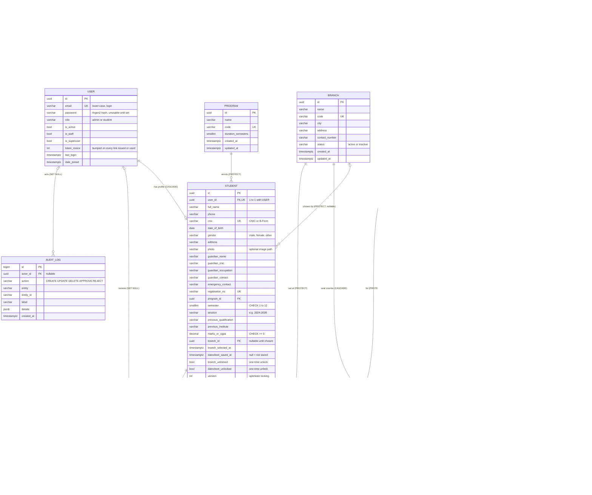

# ExamSlot: Database design (ERD)

PostgreSQL 16 on Neon. Generated from the Django models in `backend/apps/*/models.py`.
The diagram renders on GitHub; constraints, delete rules, indexes and the normalisation notes follow it.

Generated from the actual Django models in `backend/apps/*/models.py`. `docs/erd.png` (`TODO(integrator):` export this diagram, e.g. with mermaid.live) is a static copy.

`USER` also has Django's standard `groups` / `user_permissions` many-to-many tables (from `PermissionsMixin`), omitted for clarity.

### Constraints enforced by PostgreSQL

| Table | Constraint | Type | What it guarantees |
|---|---|---|---|
| `USER` | `email` unique | Unique | One account per email |
| `STUDENT` | `unique_student_registration_no`, `unique_student_cnic`, `user_id` unique | Unique | Unique registration number, CNIC, one profile per login |
| `BRANCH` | `unique_branch_code` | Unique | Unique branch code |
| `COURSE` | `unique_course_code` | Unique | Unique course code |
| `DEPARTMENT`, `PROGRAM` | `unique_department_code`, `unique_program_code` | Unique | Unique lookup codes |
| `COURSE_ASSIGNMENT` | `unique_assignment (student, course)` | Unique | Same course never assigned twice to a student |
| `EXAM_SLOT` | `unique_slot_per_course_start (course, start_at)` | Unique | No duplicate slot for a course |
| `EXAM_SLOT` | `slot_end_after_start`: `end_at IS NULL OR end_at > start_at` | Check | End time after start time |
| `EXAM_SLOT` | `slot_capacity_positive`: `capacity_per_branch IS NULL OR > 0` | Check | Valid capacity |
| `SLOT_SEAT` | `unique_seat_slot_branch (slot, branch)` | Unique | One counter per slot per branch |
| `SLOT_SEAT` | `seat_booked_within_capacity`: `capacity IS NULL OR booked <= capacity` | Check | **Overbooking is impossible**, even under races |
| `DATESHEET_SELECTION` | `one_slot_per_course (student, course)` | Unique | One slot per course per student |
| `DATESHEET_SELECTION` | `no_overlapping_exams`: `EXCLUDE USING gist (student_id WITH =, during WITH &&)` | **Exclusion** (needs `btree_gist`) | A student can never hold two overlapping exams, whatever the code does |
| `CHANGE_REQUEST` | `one_pending_request_per_type (student, type) WHERE status = 'pending'` | **Partial unique index** | At most one pending request of each type per student |
| `COURSE` | `course_credit_hours_1_6` | Check | Credit hours 1 to 6 |
| `STUDENT` | `student_semester_1_12`, `student_marks_non_negative` | Check | Valid semester and marks |

### Delete rules (foreign keys)

| Foreign key | On delete | Why |
|---|---|---|
| `STUDENT.user` | CASCADE | Deleting a login removes its profile |
| `STUDENT.branch`, `DATESHEET_SELECTION.branch` | **PROTECT** | A branch chosen by students cannot be hard-deleted (D1) |
| `STUDENT.program`, `COURSE.department` | PROTECT | Lookups in use cannot disappear |
| `COURSE_ASSIGNMENT.course`, `EXAM_SLOT.course`, `DATESHEET_SELECTION.course` | PROTECT | A course with assignments, slots or selections cannot be deleted (D10) |
| `DATESHEET_SELECTION.slot` | **PROTECT** | A slot chosen by a student cannot be deleted (D2) |
| `COURSE_ASSIGNMENT.student`, `DATESHEET_SELECTION.student`, `CHANGE_REQUEST.student` | CASCADE | Deleting a student removes their assignments, selections and requests (D10) |
| `SLOT_SEAT.slot`, `SLOT_SEAT.branch` | CASCADE | Counters are derived data; they go with their slot/branch (which are themselves protected while chosen) |
| `CHANGE_REQUEST.reviewed_by`, `AUDIT_LOG.actor` | SET NULL | History survives if an admin account is removed |

### Indexes
Every FK is indexed. Composite indexes match the list queries: `(status, name)` on branches, `(status, code)` on courses, `(course, start_at)` on slots, `(status, type, -created_at)` and `(student, -created_at)` on requests, `(program, semester)` and `(branch, datesheet_saved_at)` on students, `(slot, branch)` on selections, `(entity, -created_at)` on the audit log. `pg_trgm` GIN indexes on searched text (user email, branch name and city, course code and title, student name and registration number) keep `icontains` search fast. Partial indexes cover hot filters: students `WHERE datesheet_saved_at IS NULL`, outbox `WHERE status = 'pending'`.

### Normalisation
The schema is in **third normal form**:
- **Lookup tables instead of repeated text**: `Department` (referenced by `Course`) and `Program` (referenced by `Student`), so a department or program name is stored once and renamed in one place.
- **Login separate from profile**: `User` holds only credentials and role; `Student` holds the profile. Admins have a `User` and no `Student`.
- Guardian and academic fields stay on `Student` because they are strictly one-to-one with the student and always read together; splitting them would add joins without removing any redundancy or transitive dependency.
- Assignments, selections and requests are their own tables with foreign keys, never comma-separated lists.

### Three deliberate denormalisations
1. **`DatesheetSelection.during`** copies the slot's time range (with a missing end time filled in as start + 3 h). Postgres exclusion constraints cannot look across a join, so the copy is what lets the database itself reject overlapping exams.
2. **`DatesheetSelection.branch`** records the branch at booking time. Seat accounting and history stay correct even when the student later changes branch.
3. **`SlotSeat.booked`** is a counter instead of `COUNT(*)` over selections. "Is it full?" becomes one conditional `UPDATE ... SET booked = booked + 1 WHERE booked < capacity`, and the `CHECK (booked <= capacity)` makes overbooking impossible under concurrent saves.

---
